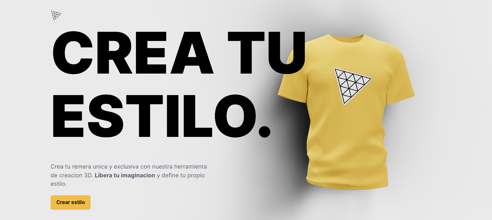

# Shirt Editor

## Descripción

Shirt Editor es un proyecto que utiliza las siguientes librerías:

- Three.js: una biblioteca 3D de alto rendimiento que facilita la creación de gráficos y escenas 3D en el navegador.
- Valtio: una biblioteca para el estado reactivo que facilita la gestión del estado de la aplicación.
- Maath: una librería matemática para cálculos complejos y manipulación de vectores.

Con Shirt Editor, podrás personalizar camisetas de forma interactiva y visualizar cómo quedarán los diseños en 3D.

-Visita mi pagina en el siguiente link:
<https://shirt-editor-five.vercel.app/>

## Proximos pasos

- IA: la proxima feature a implementar es el aporte de una IA.

## React + Vite

This template provides a minimal setup to get React working in Vite with HMR and some ESLint rules.

Currently, two official plugins are available:

- [@vitejs/plugin-react](https://github.com/vitejs/vite-plugin-react/blob/main/packages/plugin-react/README.md) uses [Babel](https://babeljs.io/) for Fast Refresh
- [@vitejs/plugin-react-swc](https://github.com/vitejs/vite-plugin-react-swc) uses [SWC](https://swc.rs/) for Fast Refresh
